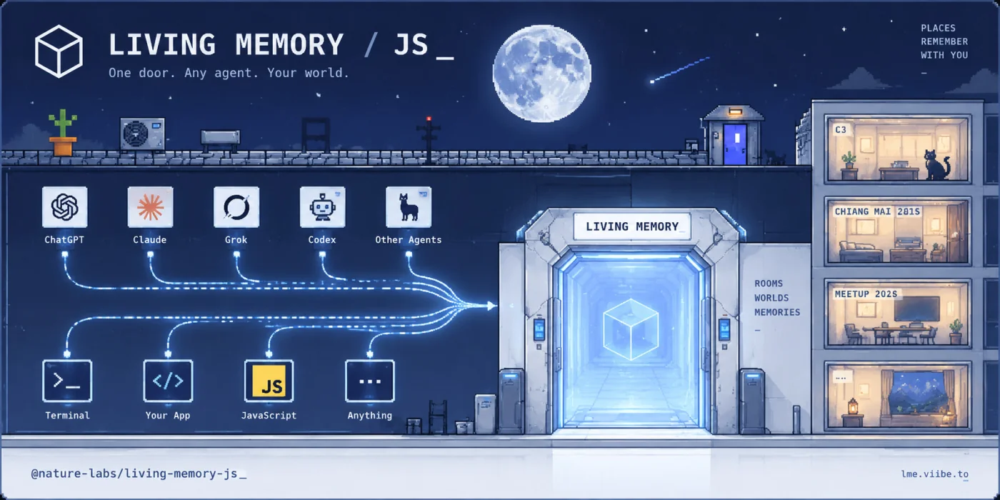

# @nature-labs/living-memory-js

[](https://www.npmjs.com/package/@nature-labs/living-memory-js)
[](./LICENSE)

The JavaScript door into a hosted Living Memory space.

Use it when you have a space URL and want to remember or search without speaking MCP.

<p align="center">
  
</p>

## Install

```bash
npm i @nature-labs/living-memory-js
```

---

## Quick start

A space address is a URL. If you do not have one yet:

```bash
curl -X POST https://lme.viibe.to/ons/new
```

Then walk in, leave something in the place, and ask how to find it:

```js
import { enterSpace } from "@nature-labs/living-memory-js"

const room = await enterSpace(process.env.LIVING_MEMORY_URL)

await room.remember("The blue door on the left opens onto the rooftop.")

const found = await room.search("how do I get to the rooftop")

console.log(found)
// [{ text: "The blue door on the left opens onto the rooftop." }]
```

That is the whole path. An address, a door, then memory.

---

## Mental model

```text
address in -> enterSpace -> remember / search
```

This is not the engine and not the stdio MCP server.

`living-memory-engine` = mind · `lme-mcp` = local mouth · `living-memory-js` = door

---

## API pointers

- `enterSpace(url)` — cross the door. Throws `SpaceError` with `code: "ENTER_FAILED"` if the address is dead or not Living Memory.
- `room.remember(text)` — leave a durable fact. Succeeds only if the whole fact is stored. `ROOM_FULL` if the space will not take another; `MEMORY_TOO_LARGE` if this one fact is too big. Never truncated.
- `room.search(query)` — recall. Returns `{ text }[]`.
- `room.debug.events` — this SDK watching the door. Print with `{ debug: true }` or `LIVING_MEMORY_DEBUG=1`. Failures also carry `error.code`, `error.cause`, `error.debug`.

---

## More

- GitHub: [v1b3x0r/living-memory-js](https://github.com/v1b3x0r/living-memory-js)
- Engine: [@nature-labs/living-memory-engine](https://www.npmjs.com/package/@nature-labs/living-memory-engine)
- Local MCP: [@nature-labs/lme-mcp](https://www.npmjs.com/package/@nature-labs/lme-mcp)
